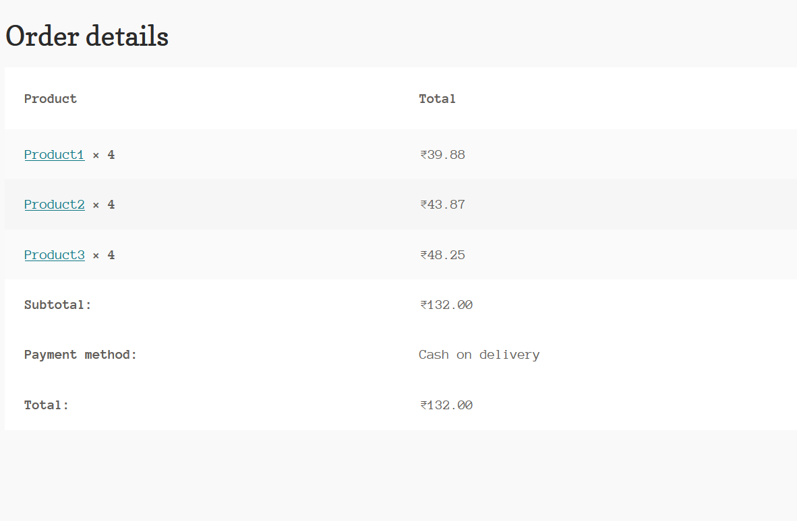
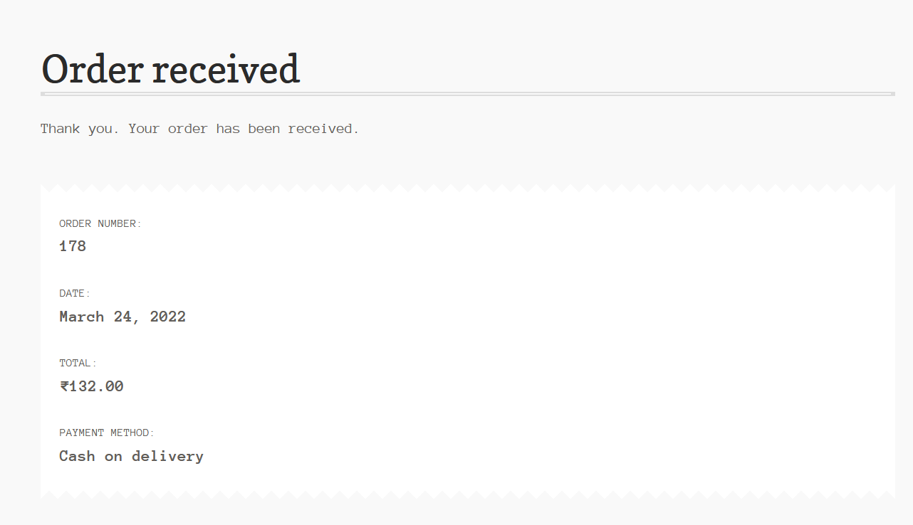

# woocommerce

Project to demonstate the web automation using Selenium, TestNG and Java

-   Automation script for creation of products 

-   Automation Test for checkout the products

## Pre-requisite:
Download Java 17.0.2 2022-01-18 LTS from [_here_](https://download.oracle.com/java/17/latest/jdk-17_windows-x64_bin.exe) for windows and install.

Download Eclipse [_link_](https://www.eclipse.org/downloads/) and install.

### Setting system properties.
- For instance Java is installed on "C:\Program Files\Java\jdk-17.0.2" location  
- java bin directory in windows system path variable as "C:\Program Files\Java\jdk-17.0.2\bin"
- create system variable JAVA_HOME as shown below.

#### Example:
JAVA_HOME=C:\Program Files\Java\jdk-17.0.2

### Setting Environment:
- Install XAMPP  
- Install WordPress
- Install WooCommerce

## Open complete package in eclipse IDE

> Clone git repo

> From Eclipse IDE Import project 

# creation of products 

### Update config.properties
Change admin url, login name & password in config.properties available in **src\test\resources** folder

Before running change url in config.properties

url=**url name**

username=**login name**

password=**password**

### Run TestNG script

Navigate to AddProduct.java file under productcreation package 

Right click --> Run As --> TestNG Test (or) Rull All

**For reference screenshot:**

# checkout the products

Once the product is created.

Change the url in config.properties to shop Ex : http://127.0.0.1/wordpress/shop

Navigate to LoadCart.java file under AddToCart package 

Right click --> Run As --> TestNG Test (or) Run All 

Note: URL should navigate directly to shop the products page otherwise the script won't proceed further.

**For reference screenshot:**

