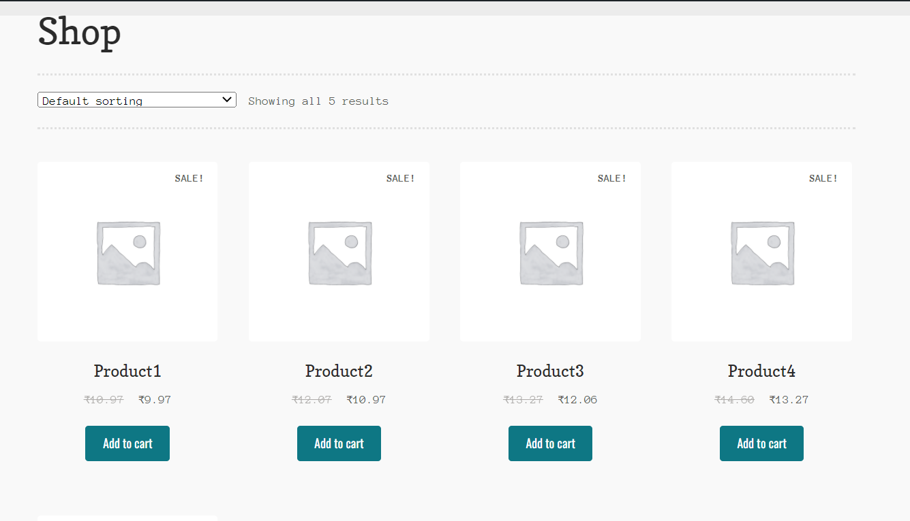

# woocommerce
Automation script for creation of products.

Automation Test for checkout the products

## Pre-requisite:
Download Java 17.0.2 2022-01-18 LTS from [_here_](https://download.oracle.com/java/17/latest/jdk-17_windows-x64_bin.exe) for windows and install it.

### Example:
#### Setting system properties if it's not done already.
- For instance Java is installed on "C:\Program Files\Java\jdk-17.0.2" then add  
- java bin directory in windows system path variable as "C:\Program Files\Java\jdk-17.0.2\bin"
- create an environment variable java_home if not already available.

JAVA_HOME=C:\Program Files\Java\jdk-17.0.2

## Update config.properties
- Change admin url, login name, password in config.properties available in **src\test\resources** folder

**To run the automation script to creation of products**
make sure to change url in config.properties
url=<url name>
username=<login name>
password=<password>
	
- After products are created change to shop url in config.properties as : http://127.0.0.1/wordpress/shop

Note: URL should navigate directly to shop the products page otherwise the script won't proceed further.

## Add product screenshot

